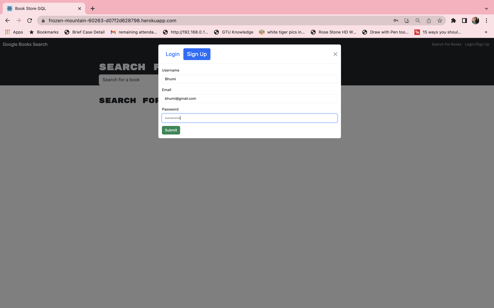

# BOOKSTOREGQL

Book Store GQL search for new books to read, keep a list of books to purchase and delete books from purchase list using graphQL.

## Description

This website allows you to search for books of your liking from a Google Book API. Based on your search there will be a list of books that match the description. You are also given the option to create an acount and sign in to that account. This is verified using JWTs to verify the user. When you are logged in you are able to add the books you wish to your book list. You can also remove them at a later time if you wish to do so.

In Book Store GQL application,

GIVEN a book search engine

- WHEN user load the search engine,
  THEN user presented with a menu with the options Search for Books and Login/Signup and an input field to search for books and a submit button.
- WHEN user click on the Search for Books menu option,
  THEN user presented with an input field to search for books and a submit button.
- WHEN user not logged in and enter a search term in the input field and click the submit button,
  THEN user presented with several search results, each featuring a book’s title, author, description, image, and a link to that book on the Google Books site.
- WHEN user click on the Login/Signup menu option,
  THEN a modal appears on the screen with a toggle between the option to log in or sign up.
- WHEN the toggle is set to Signup,
  THEN user presented with three inputs for a username, an email address, and a password, and a signup button.
- WHEN the toggle is set to Login,
  THEN user presented with two inputs for an email address and a password and login button.
- WHEN user enter a valid email address and create a password and click on the signup button,
  THEN my user account is created and user logged in to the site.
- WHEN user enter my account’s email address and password and click on the login button,
  THEN user the modal closes and user logged in to the site.
- WHEN user logged in to the site,
  THEN the menu options change to Search for Books, an option to see my saved books, and Logout.
- WHEN user logged in and enter a search term in the input field and click the submit button,
  THEN user presented with several search results, each featuring a book’s title, author, description, image, and a link to that book on the Google Books site and a button to save a book to my account.
- WHEN user click on the Save button on a book,
  THEN that book’s information is saved to my account.
- WHEN user click on the option to see my saved books,
  THEN user presented with all of the books user have saved to my account, each featuring the book’s title, author, description, image, and a link to that book on the Google Books site and a button to remove a book from my account.
- WHEN user click on the Remove button on a book,
  THEN that book is deleted from user saved books list.
- WHEN user click on the Logout button,
  THEN user logged out of the site and presented with a menu with the options Search for Books and Login/Signup and an input field to search for books and a submit button.

In this book serach engine application, I used Javscript,MongoDB,Graphql,Appllo Client/server,Google Book API,React,Mongoose,JWT.

# Table of Contents

- [Installation](#installation)
- [Usage](#usage)
- [Credits](#credits)
- [License](#license)
- [Badges](#badges)

# Installation

For this MERN application,

- On client terminal run command - npm i @apollo/client graphql
- On server terminal run command - npm i @apollo-server-express
- then for all packages run command - npm install
- for seed run command - npm run seed
- to run application run command - npm run develop

# Usage

The URL of the functional, deployed application - https://blooming-spire-61902-b62883f5d525.herokuapp.com/

The URL of the GitHub repository - https://github.com/avanijadeja/book-search-engine

# Credits

Made by Avani Jadeja

# License

This project is using the MIT License.

# Badges

